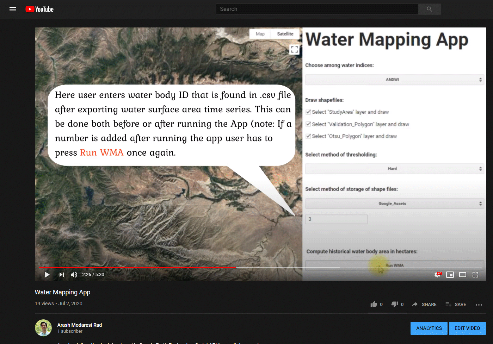

# Water Mapping App

A [Google Earth Engine](https://code.earthengine.google.com/) App that delineates water bodies around the globe from 1984 until present and provides monthly estimates of surface area of water bodies as well as shapefiles to the user.

##### Table of Contents

- [Introduction](#the-need-for-automation-of-inland-water-body-mapping)
  * [Example](#example)
- [App Options](#app-options)
- [How To?](#how-to)
  * [Tutorial](#tutorial)
  * [GEE Code Edithor](#gee-code-edithor)
  * [Cloning](#Cloning)
- [Documentation](#documentation)
- [Acknowledgments](#acknowledgments)
- [Authors](#authors)
- [License](#license)

## The Need for Automation of Inland Water Body Mapping

Inland water bodies play a significant role in hydrological systems, and are essential resources for many human needs such as irrigating croplands and survival of different ecosystems. Both climate change and human interventions are causing large changes in the water bodies on a global scale and such changes will affect agriculture, industry, ecology, and population. The need to map surface water bodies becomes more revealing in water resources management of basins in remote locations with no gauging instruments. Recent advances in satellite‐based optical remote sensors have provided a routine approach for monitoring land surface water bodies in real-time. 

### Example

A demonstration is shown in the figure below, where the image to the left is the Pyramid Lake (located in Nevada, United States) true color composite of three red, green and blue bands from Landsat 8 and the image to the right is the extracted water body that is comprised of water (cyan areas) and non-water (black areas) features.


## App Options

The App is desigend in way that users can have the following options:

1. #### Users can select feom range of Spectral Water Indices including

- ANDWI

- MNDWI

- NDWI

- AWEIsh

- AWEInsh

- WI

2. #### Select their study area using a polygon drawing feature

3. #### Chose from the two options of

- Hard thersholding (e.g., zero defining the threshold seperating water and non-water)

- Dynamic thersholding (e.g., Otsu method for finding optimum threshold seperating water and non-water)

4. #### Select an exporting method

- Google Drive

- Google Assets

5. #### Select an ID associated with the date of intrest to export a shapefile of water body

## How To?

### Tutorial

YouTube tutorial video:

Here is a YouTube link to the vidoe [YouTube](https://youtu.be/7RovfG7IeM8).



### GEE Code Edithor

Google Earth Engine Link to Share the Project: 

Here is a GEE link to the project [GEE](https://code.earthengine.google.com/?accept_repo=users/Water_Delineation/water).


### Cloning

```shell
git clone https://earthengine.googlesource.com/users/Water_Delineation/water
```
# Acknowledgments

.gif)

This material is based on grant provided by CUAHSI with support from the National Science Foundation (NSF) Cooperative Agreement No. EAR-1849458.

# Authors

[developer list](authors.md)

# License

MIT
