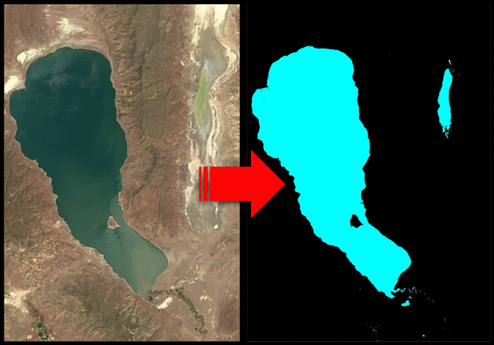
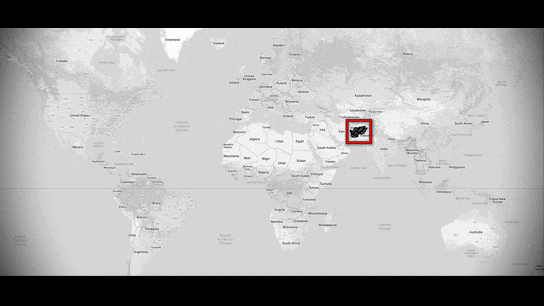
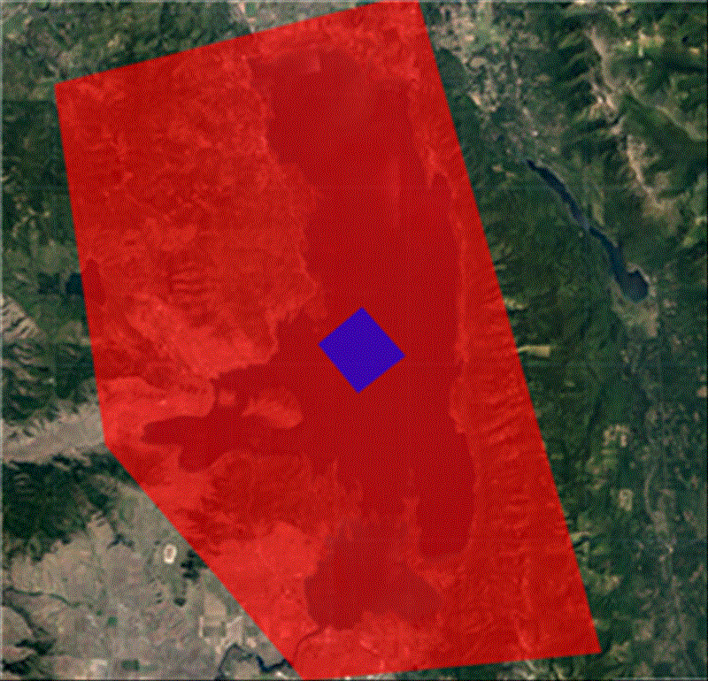
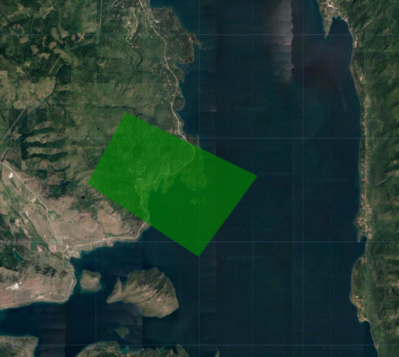
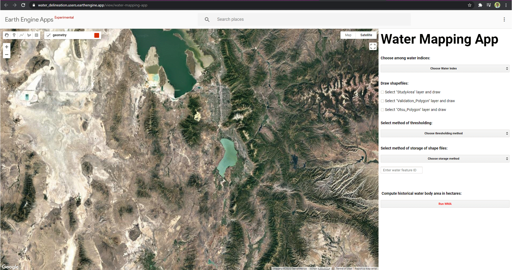

# Water Mapping App

A [Google Earth Engine](https://code.earthengine.google.com/) App that delineates water bodies around the globe from 1984 until present and provides 16 day estimates of surface area of water bodies as well as shapefiles to the user.

##### Table of Contents

- [Introduction](#the-need-for-automation-of-inland-water-body-mapping)
  * [Example](#example)
- [App Options](#app-options)
- [How To?](#how-to)
  * [Tutorial](#tutorial)
  * [General Tips](#tips)
  * [GEE Code Edithor](#gee-code-edithor)
  * [Cloning](#Cloning)
- [Documentation](#documentation)
  * [Cloud Filtering](#cloud-filtering)
  * [Augmented Normalized Difference Water Index](#augmented-normalized-difference-water-index)
  * [References](#references)
- [Acknowledgments](#acknowledgments)
- [Authors](#authors)
- [License](#license)

## The Need for Automation of Inland Water Body Mapping

Inland water bodies play a significant role in hydrological systems, and are essential resources for many human needs such as irrigating croplands and survival of different ecosystems. Both climate change and human interventions are causing large changes in the water bodies on a global scale and such changes will affect agriculture, industry, ecology, and population. The need to map surface water bodies becomes more revealing in water resources management of basins in remote locations with no gauging instruments. Recent advances in satellite‐based optical remote sensors have provided a routine approach for monitoring land surface water bodies in real-time. 

We propose a novel spectral index namely Augmented Normalized Difference Water Index (ANDWI) by analyzing reflectance characteristics of water and non-water surface features in Landsat 4, 5, 7, and 8 surface reflectance imagery. ANDWI is defined as the normalized difference of visible and near inferred bands. To evaluate the performance of ANDWI classification, 8 study areas were selected from different parts of the globe that have unique spectral features that result in misclassification errors in the already proposed water indices in literature. These land surface features include presence of shadows induced by the mountains or buildings that are known to produce commission errors; presence of different built-up material such dark and bright rooftops and asphalt resulting in commission errors; presence of hot water bodies and geothermal lakes that induce omission errors; presence of muddy waters that produce omission errors; passing of dust storms over the water body that causes omission errors; presence of frozen lakes that produce omission errors; and presence of dark vegetation that induces commission errors. 


Two methods of conventional zero and Otsu thresholding was used to determine the threshold separating water and non-water features. Higher resolution imagery from WorldView 2 and 3, Sentinel 2, and Landsat 7 and 8 panchromatic sharpened imagery were used as the ground truth. To compute the ANDWI accuracy, for each of the scenario discussed above a balanced dataset was created and to compute total accuracy and compensate for skewed class proportions from each scenario a down sampling technique was used. Different accuracy metrics including percentages of commission and omission errors, precision, recall, accuracy, F1 score, and Cohen's Kappa coefficient were used to assess the performance of the proposed model as well as other well-known indices in literature such as NDWI, MNDWI, AWEIsh, AWEInsh, and WI.

### Example

A demonstration is shown in the figure below, where the image to the left is the Pyramid Lake (located in Nevada, United States) true color composite of three red, green and blue bands from Landsat 8 and the image to the right is the extracted water body that is comprised of water (cyan areas) and non-water (black areas) features.



Also a time laps of Hamun lake is shown below that covers a period of 1984-2020.


## App Options

The App is desigend in way that users can have the following options:

1. #### Users can select from range of Spectral Water Indices including

- ANDWI  =   $\dfrac{({Blue + Green + Red})-({Nir + Swir1 + Swir2})}{({Blue + Green + Red})+({Nir + Swir1 + Swir2})}$

- MNDWI

- NDWI

- AWEIsh

- AWEInsh

- WI

2. #### Select a study area using a polygon drawing feature

3. #### Chose from the two options of

- Hard thersholding (e.g., zero defining the threshold seperating water and non-water)

- Dynamic thersholding (e.g., Otsu method for finding optimum threshold seperating water and non-water)

4. #### Select an exporting method

- Google Drive

- Google Assets

5. #### Select an ID associated with the date of intrest to export a shapefile of water body

## How To?

## App Tips

- From a global study that I did, the highest accuracy was achieved using **ANDWI** or **MNDWI** with **dynamic thresholding** using Otsu method see this [Paper](https://doi.org/10.1016/j.envsoft.2021.105030) for more details and discussions. 
- Please make sure that both "Validation_Polygon" and "Otsu_Polygon" layers are inside the "StudyArea" layer.
- The smaller the "Validation_Polygon" the more computational efficiency it would be, I prefer selecting a small area in the middle of "StudyArea" layer.

- The best results for Otsu thresholding / dynamic thresholding (selecting the "Otsu_Polygon") is achieved when half of the pixels are in land area and the other half are in the water   

- Make sure you put a number in "Enter water feature ID" the ID corresponds to the output .csv file index numbers meaning that once you get the .csv file you can run the model n times with different IDs to get shapefiles for different dates.
- You can keep the App open and press "Run WMA" as many times with different settings.


### Tutorial

YouTube tutorial video:

Here is a YouTube link to the vidoe [YouTube](https://youtu.be/7RovfG7IeM8).


### GEE Code Edithor

To access the project first a GEE acount must be created [SignUp GEE](https://earthengine.google.com/signup/), then one can use th Google Earth Engine Link below to Share the Project: 

Here is a GEE link to the project [Water Mapping App](https://code.earthengine.google.com/?accept_repo=users/Water_Delineation/water).



### Cloning

```shell
git clone https://earthengine.googlesource.com/users/Water_Delineation/water
```
During the cloning process the user is asked to enter his/her own GEE user account and password. To luanch the App simply go to **RUN** script and press the run buttons above the code editor for running the script. Just a note, the process of clonning may take up to 4 hours to complete!

## Documentation

### Cloud Filtering 

To deal with cloudy scenes a novel framework was developed that filters only those images that cloud is on top of the water body. The CFMASK algorithm in Landsat imagery can result in inappropriate removal of clouds in some scenes due to relatively high commission errors produced by this algorithm. My proposed method uses historical changes of difference of two water indices (in which one classifies clouds as water and the other does not) to filter out cloudy scenes. This method increases the number of useful imageries compared to cloud percentage-based filtering algorithms and thus provides more observations over time.

### Augmented Normalized Difference Water Index  

A novel spectral index namely Augmented Normalized Difference Water Index (ANDWI) is proposed by analyzing reflectance characteristics of water and non-water surface features in Landsat 4, 5, 7, and 8 surface reflectance imagery. ANDWI is defined as the normalized difference of visible and near inferred bands. Results showed that ANDWI is more robust compared to the other spectral water indices but when it is used with zero thresholding it can generate commission errors due to presence of shadows, asphalts, and dark and bright rooftops. However, Otsu thresholding appropriately adjusts the threshold automatically and removes these commission errors thus further increases the overall accuracy of ANDWI.

### References  

...

# Acknowledgments

.gif)

This material is based on grant provided by CUAHSI with support from the National Science Foundation (NSF) Cooperative Agreement No. EAR-1849458.

# Authors

[developer list](authors.md)

# License

MIT
